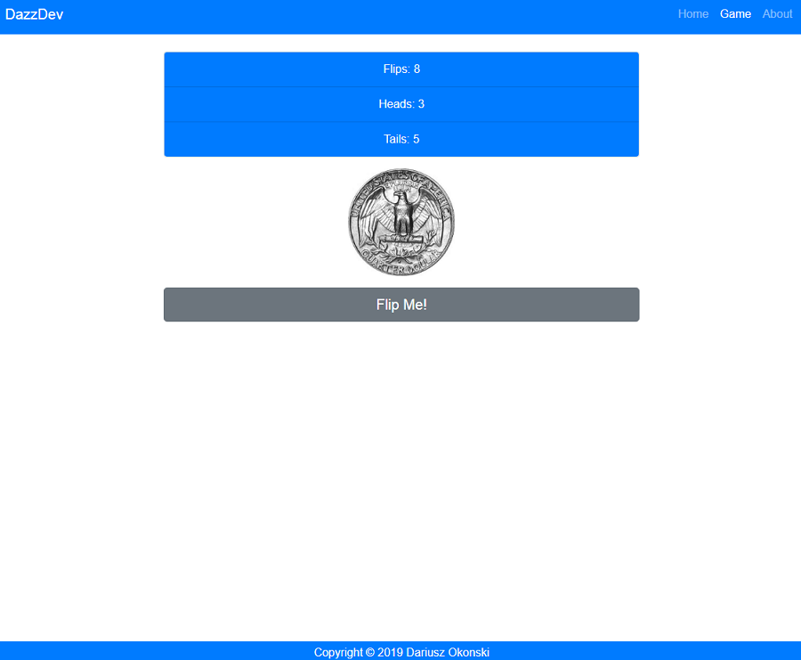

# Coin Flipper App in React

Coin Flipper is a create react app. It was created for both mobile and desktop views. It is displaying a coin after
clicking a button. It also count heads, tails and all flips and displaying it. It contains menu with Home, Game and About
options.

## Tools & Technology used

- Visual Studio Code
- React
- HTML
- CSS
- Bootstrap 4.0
- Hooks (useState, useContext)
- ContextAPI
- react-router-dom
